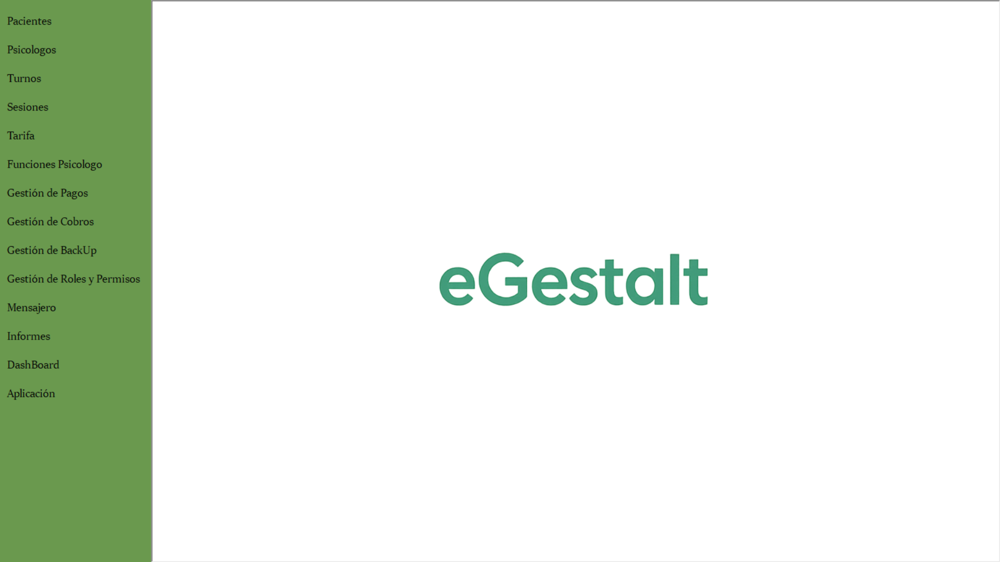
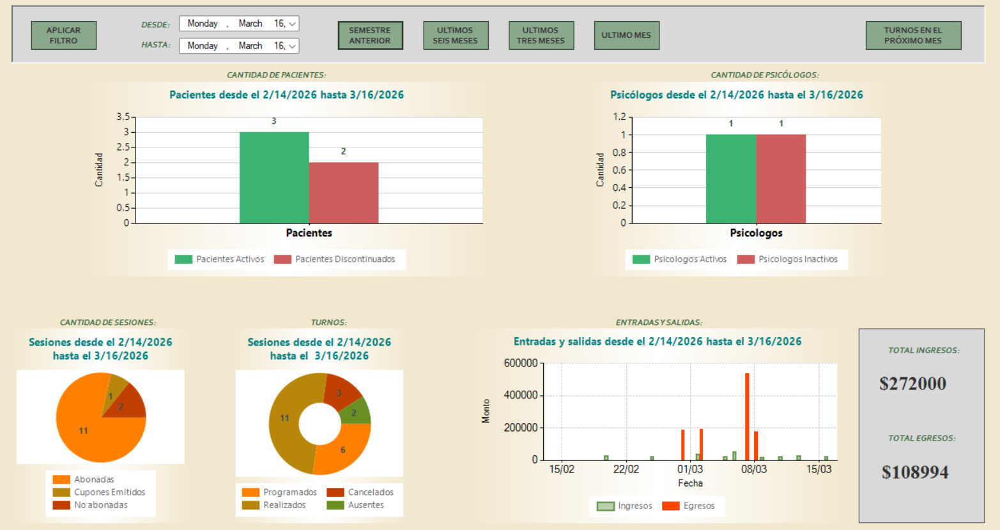
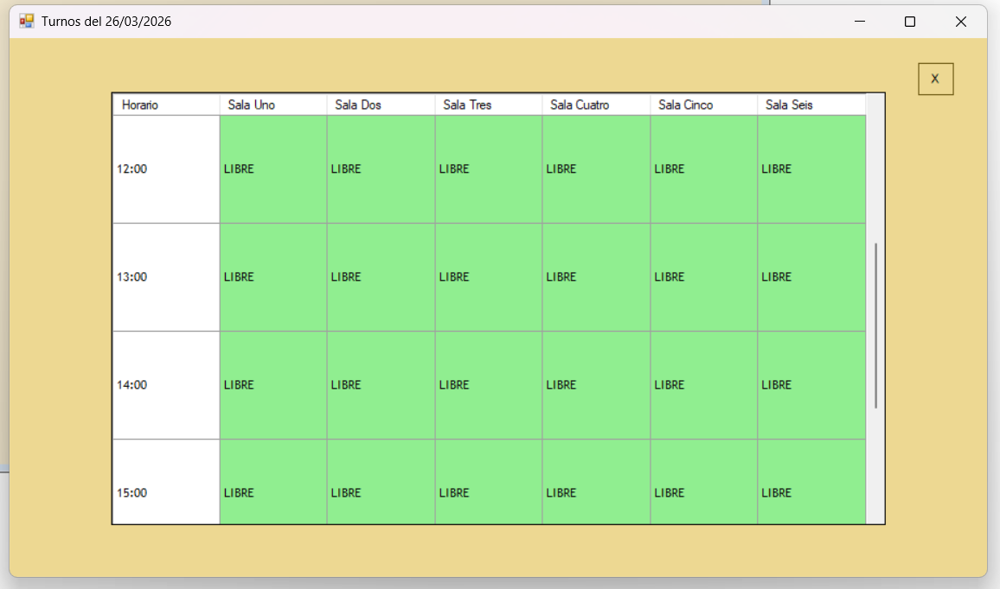
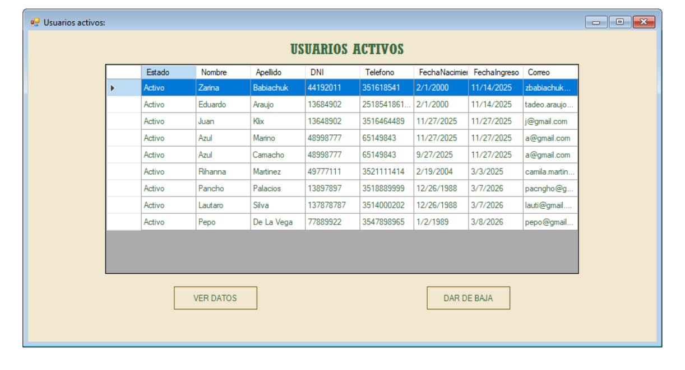
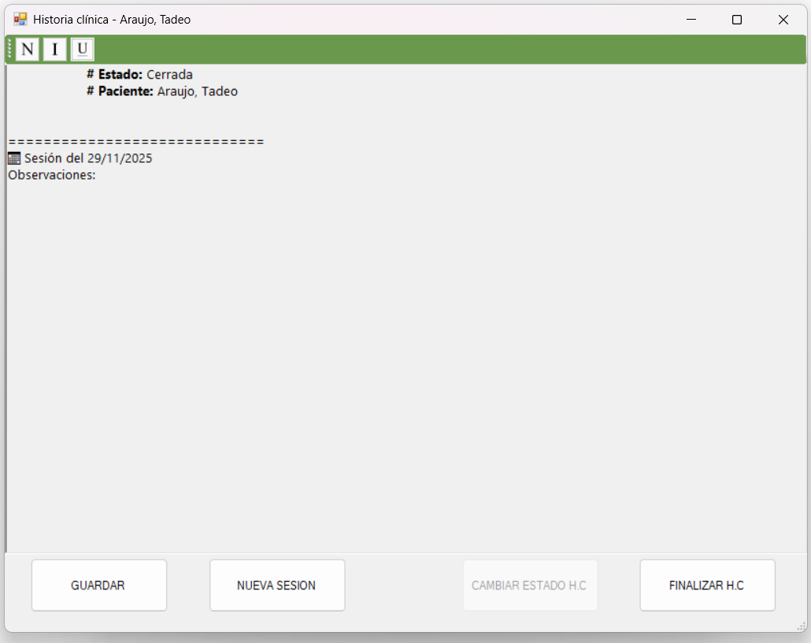

# eGestalt

Sistema de gestión de turnos, sesiones y facturación para clínicas psicológicas desarrollado en C# WinForms.

## Funcionalidades
- Gestión de pacientes
- Gestión de psicólogos
- Turnero diario y mensual
- Gestión de sesiones
- Generación de cupones de pago
- Generación de facturas
- Dashboard
- Historias clínicas digitalizadas
- Persistencia en XML
- Instalador generado con Advanced Installer

## Tecnologías
- C#
- .NET Framework
- WinForms
- XML como base de datos
- Arquitectura en capas (BE, BLL, MAP, UI)

## Instalación
Ejecutar el instalador incluido en la carpeta /Instalador.

## Autor
[Tadeo Araujo Figueroa]

## Screenshots

### Menú

### Dashboard

### Turnero

### Pacientes

### Historias clínicas

